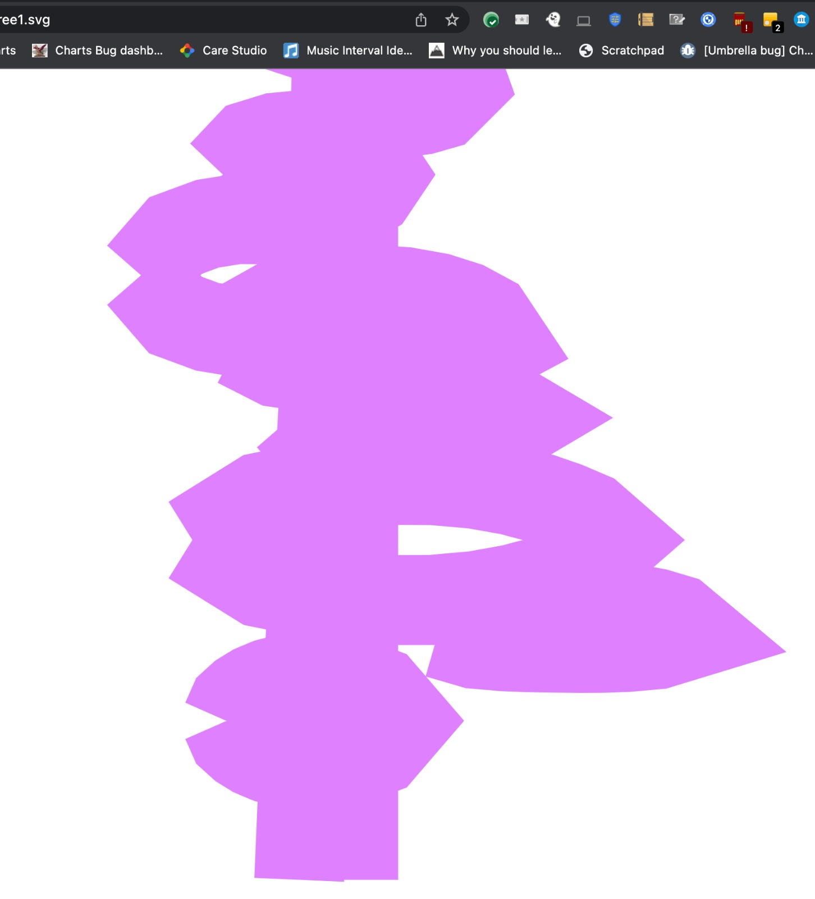
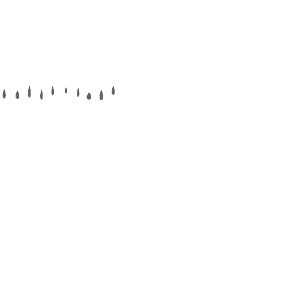
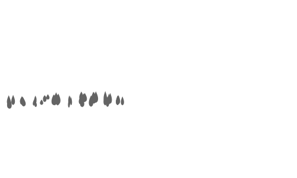

Day 4

Prev: 
 - Aims
 - Lines and blobs first


Today I'm trying to replicate the blob function <https://github.com/zverok/grok-shan-shui/blob/main/original.html#L578>, one of the fundamental drawing functions of the library. Once this is done, we should be able to start drawing some recognisable objects.

As the name tells us, this is basically shading a "blob", a solid block of colour. From reading this excellent post <https://zverok.github.io/advent2021/day02.html>, we determine that the blobs at the top of the trees are made by the blob function, so we have an idea of what the end result might look like. 

However, I found the code quite complicated. 

What I like to do in this situation is see if I can break up the code into independent pieces. Then I can understand the pieces individually, and represent them as chunks in my brain. Then hopefully the whole function can be described with not too many chunks for my brain to handle. 

First I'm going to write the function signature. The JS code has some optional arguments, but I don't think Rust has this feature, so I'll have to make them all explicit. 

```rust
fn blob(x: f32, y: f32, 
    len: int, 
    width: int,
    ang: int,  // todo maybe a float?
    colour: Color, 
    noise: f32, 
    ret: int,
    f: &dyn Fn(f32) -> f32,
) -> Shape {

}
```
(Later, when I'm calling blob, I'll think if there's some way to make it easier for the callers, such as having a default_blob() function that fills the default values for most of the parameters in. What that looks like precisely will depend on the main usages.)

The first thing I loook for is some variables that are only used over a small scope, normally to build another variable to use later. In this case, I saw that `lalist` is populated in a loop, and the other variables in the loop are not used outside that context. This made me think this was a good candidate for writing as a stand-alone function and understanding independently.

Here's the original code

```rust
     var reso = 20.0;
     var lalist = [];
     for (var i = 0; i < reso + 1; i++) {
       var p = (i / reso) * 2;
       var xo = len / 2 - Math.abs(p - 1) * len;
       var yo = (fun(p) * wid) / 2;
       var a = Math.atan2(yo, xo);
       var l = Math.sqrt(xo * xo + yo * yo);
       lalist.push([l, a]);
    }
```

And here's my fairly literal translation into Rust:
```rust
fn la_list(resolution: int, len: int, f: &dyn Fn(f32) -> f32) -> Vec<(f32, f32)> {
    let mut out = vec![];

    for i in 0..resolution+1 {
        let p = (i/resolution) * 2;
        let xo = len/2 - ((p-1).abs() * len);
        let yo = (f(p) * wid) /2;
        let a = y0.atan2(x0);
        let l = (xo*xo + yo*yo).sqrt();
        out.push((l, a));
    }
    return out;

}
```
Now what's going on here? 

I'm lucky in that I did a degree in Maths, so I no longer recoil with horror when I see trigonometry. 

When I look at definition of l, I notice that this is pythagoras' theorem for finding the length of the longest side of a right angled triangle. And looking up the docs of atan2, it's the angle between the (positive) x-axis and the point (xo, yo). If it's easier, here it is in diagram form:
```rust

          / (x0, y0)
         /
        /
   l   /
      /
     /
    /
   /
  /
 /
/ (a)
------------
```
l is the length of the line made out of slashes, and a is the angle between that line and the horizontal. 

So at this point, I'm thinking la_list stands for "line and angle list". But I'm still not clear what these are lines and angles _of_. 

We're generating xo and yo before getting their line/angle. Let's look more at the code and work out what's happening. 

```    rust
    for i in 0..resolution+1 {
        let p = (i/resolution) * 2;
```

So we're dividing the range (0, 2) into <resolution> segments and generating an (xo, yo) for each of these. 

```rust
        let xo = len/2 - ((p-1).abs() * len);
```

For xo, len is probably a length we can configure, and we can see that it exists in both terms of the above subtraction. We can do a small rearrangemnt to get: 

```rust
        let xo = len * (1/2 - (p-1).abs());
```

now if we remember that if p ranged from 0 to 2, then p-1 ranges from -1 to 1, (p-1).abs() ranges from 1 to zero and back to 1 again, and the whole xo term (ignoring length) ranges from -0.5 to +0.5 and back to -0.5.

<maybe demonstrate this with a table>

Recalling that X is the horizontal axis, this means that we are moving from the left hand side of the canvas to the right hand side, and then back. 


(If you're a maths-person, you probably recognise this as parametric equations for a curve.)

So now I think I have a good understanding of what's going on. We're going to be drawing a circle or circle-like shape (or an approximation to one, a polygon with many sides).

(Think about drawing a circle on a piece of paper, starting at the leftmost point - thinking only about the left-right motion you would move your hand from the left to the right and then back to the left.)

```        rust
let yo = (f(p) * wid) /2;
```

For `yo`, we have a function call. This is a bit of abstraction that allows the function to be more general, but at the cost of some readability.

In the same way that `x0` moves left and right as `p` moves from 0 to 2, `yo` will move as well - but in this case the movement is in the up-down axis. 

You can also see that we are multiplying the function call `f(p)` by the `wid` parameter. I had assumed this parameter stodd for "width", but we seem to be using it to change the up-down scale, which is a bit confusing to me.


The next part of blob concerns generating nslist. 

```rust
//     var nslist = [];
//     var n0 = Math.random() * 10;
//     for (var i = 0; i < reso + 1; i++) {
//       nslist.push(Noise.noise(i * 0.05, n0));
//     }
//     loopNoise(nslist);
```

As we call Noise.noise, I am thinking that nslist stands for "noise_list", a list of random numbers that I guess we will use to make our blobs look more random and therefore more arty. 

```rust
fn generate_noise_list(len: usize) -> Vec<f64> {
    let mut rng = rand::thread_rng();
    return (0..len).into_iter().map(|_| rng.gen()).collect();
}
```

The final non-returning chunk of the function is putting together plist

```        rust
//     var plist = [];
//     for (var i = 0; i < lalist.length; i++) {
//       var ns = nslist[i] * noi + (1 - noi);
//       var nx = x + Math.cos(lalist[i][1] + ang) * lalist[i][0] * ns;
//       var ny = y + Math.sin(lalist[i][1] + ang) * lalist[i][0] * ns;
//       plist.push([nx, ny]);
//     }
```        

Our plist is filled with things called (nx, ny), so I'm guessing that this stands for "points list", and when we look ahead to the main way this function returns, it calls poly(), which takes a list of points as arguments. 

```rust
//     if (ret == 0) {
//       return poly(plist, { fil: col, str: col, wid: 0 });
//     } else {
```

So what's happening in plist? We're looping over the lines and angles we created earlier. For each one, we're generating a pair of (x, y) co-ordinates, and our blob is a filled polygon that connects all these points.

```rust
//       var ns = nslist[i] * noi + (1 - noi);
```
This is a noise term, generated per point. It's also scaled by the function-level noi variant, which allows callers to control if all the points should be more or less noisy. 

```rust
//       var nx = x + Math.cos(lalist[i][1] + ang) * lalist[i][0] * ns;
```

lalist[i][1] is just the angle we worked out in lalist() function.

Warning
If you remember trigonometry, you might remember that the Cos functions allows us to get the length of the sides of triangles from angles. In this case. 

```Math.cos(lalist[i][1] + ang) * lalist[i][0] ```

tells us the length of the horizontal line in the below (which is xo), given the length l and angle a.

```

          / (x0, y0)
         /
        /
   l   /
      /
     /
    /
   /
  /
 /
/ (a)
------------

```

This seems strange to me - in lalist, we generated x0 and y0, and then used that to work out l and a. Now we take l and a, and work out x0. Why didn't we just hold onto x0?

[Insight from day 6: oh, we adjust the angle sometimes using ang. This is a way of rotating the initial shape, and will probably be needed at some point]

```rust
//       var ny = y + Math.sin(lalist[i][1] + ang) * lalist[i][0] * ns;
```

Tomorrow I'll actually write this code up and see if I can get it working.

DAY 5 

Got the code for the blobs working, but it's really irritating to have to specify the different numerical types of things. I guess when you're doing low-level stuff, this becomes an important consideration, but I don't care at all for this kind of thing. 

```rust
fn blob(
    x: f64,
    y: f64,
    length: f64,
    width: f64,
    ang: f64, // todo maybe a float?
    // colour: Color,
    noise: f64,
    ret: bool,
    f: &dyn Fn(f64) -> f64,
) -> Shape {

    let resolution = 60;

    let lengths_and_angles = generate_lengths_and_angles(resolution, length, width, f);

    // todo LOOPNOISE
    let noise_list = generate_noise_list(lengths_and_angles.len());
    let mut points_list = vec![];
    for i in 0..(lengths_and_angles.len()) {
        let this_noise = noise_list[i] * noise + (1.0 - noise);
        let this_angle = lengths_and_angles[i].1 + ang;
        let nx = x + this_angle.cos() * lengths_and_angles[i].0 * this_noise;
        let ny = y + this_angle.cos() * lengths_and_angles[i].0 * this_noise;

        points_list.push((nx, ny));
    }

    if ret {
        return super::line_from(points_list);
    } else {
        todo!()
    }
}

```

Unfortunately I got a blank canvas the first time I ran this, so I set about debugging it. I don't yet know how to run a debugger in Rust, so I chucked in some print statements after generating my lengths_and_angles and points list. 

I removed the "unneccesary" trigonometry, because I kept getting NaN numbers, and that seemed to be the fastest way to get the blobs working. [Actually, it turns out when I went over it that the trigonometry was needed to adjust the angle using the ang paramter. I've set myself up a branch to fail when I eventually hit that: ]

```rust
    if ang != 0.0 {
        todo!();
    }
```

I was still getting NaNs in my points list, but only a couple out of the 20, so I just added a terrible hack to discard any NaNs and log a warning.

Lo and behold, blobs!


They don't look quite the same though - I wondered if something was wrong (beyond the NaNs). Ah, I still have a TODO for "loop noise". THat's to do tomorrow then! [Edit from the future: Actually, I Implemented the noise_list wrong as well - nice work if you spotted this!]

DAY 6 

Today I was meant to investigate the loopNoise function. However I noticed an odd thing in the very first line: 

```rust
  function loopNoise(nslist) {
    var dif = nslist[nslist.length - 1] - nslist[0];
  ```

The first line of loopNoise calculates a diff between the first and last elements of the noise list. This confused me at first because I thought that the list was entirely random, and I didn't expect the first and last to have any special significance. It turns out that I read the code wrong yesterday and in fact the elements of it are distributed differently from one another:

```rust
   var n0 = Math.random() * 10;
    for (var i = 0; i < reso + 1; i++) {
      nslist.push(Noise.noise(i * 0.05, n0));
    }
```
Now, unfortunately for me, this Noise.noise is a custom implementaiton, and looks extremely hard for me to understand. It's 65+ lines of code with single letter variables being manipulated on every line (see here: https://github.com/zverok/grok-shan-shui/blob/main/original.html#L102 )

Luckily, there's some well named variables in the containing scope, and a link to some documentatino that suggests that this is an implementation of Perlin Noise. I have no idea what this is, but it's something I can google! I get told:

> Perlin noise is a popular procedural generation algorithm invented by Ken Perlin. It can be used to generate things like textures and terrain procedurally, meaning without them being manually made by an artist or designer. The algorithm can have 1 or more dimensions, which is basically the number of inputs it gets.

Nice! Textures and Terrain - sounds good given what we're trying to make. Another Google tells me that this already exists for rust, so all I need to do is use the Crate! <https://docs.rs/noise/latest/noise/>

It looks like I can just transliterate the JS code directly to get this

```rust
fn generate_noise_list(len: usize) -> Vec<f64> {
    let perlin = Perlin::new();

    let mut rng = rand::thread_rng();
    let noise_base: f64 = rng.gen::<f64>() * 10.0;

    let noise_for_index = |i| perlin.get([(i as f64) * 0.05, noise_base]);
    let out = (0..len).into_iter().map(noise_for_index).collect();

    return out;
}
```

I find the "into_iter()" and "collect()" calls a little irritating, but I'm sure there's a good reason for it. (I'm mildly tempted to write my own fmap function that will do this for me, but I doubt that's very Rust-y.)

I run the code again and they are less spiky now!

Before:


After:


They're still a bit spiky on the left - will look into that tomorrow.


DAY 7 

Ok, after a day of diversion, we're back to looking at loopNoise! What's going on here then?

```rust
  function mapval(value, istart, istop, ostart, ostop) {
    return (
      ostart + (ostop - ostart) * (((value - istart) * 1.0) / (istop - istart))
    );
  }
  function loopNoise(nslist) {
    var dif = nslist[nslist.length - 1] - nslist[0];
    var bds = [100, -100];
    for (var i = 0; i < nslist.length; i++) {
      nslist[i] += (dif * (nslist.length - 1 - i)) / (nslist.length - 1);
      if (nslist[i] < bds[0]) bds[0] = nslist[i];
      if (nslist[i] > bds[1]) bds[1] = nslist[i];
    }
    for (var i = 0; i < nslist.length; i++) {
      nslist[i] = mapval(nslist[i], bds[0], bds[1], 0, 1);
    }
  }
  ```

This code modifies the list in place, but I will return a new list, which I assume is more Rust-y. 

It took quite a while to understand what was going on here, and I'm grateful to my friend Austin for jumping on a call with me  to talk it through. 

The crux lies in understanding 
1) these are noise terms that will be applied on a pointwise basis
2) The Perlin noise we developed yesterday is designed to be "smooth" in some sense. That is, unlike the first naive go at randomness, where the points were independent:


our efforts from yesterday are much smoother: 


However, there is an exception on the left hand side of each of these pictures, where there's a much more jagged shape. This is because the Perlin noise we generated is designed to be smooth when used in a _linear_ fashion, but we are using it in a _circular_ fashion: when we apply the noises, we're applying it round the circumfrence of our circular-ish shape.

When I was thinking about this, I imagined the Perlin noise as generating the height of a landscape as we walk along it. It will be "smooth", rather than having cliffs. (N.B. We are sampling the Perlin noise at discrete points, but I don't think that changes the fundamental idea here.)


When we have our noise applied to a circular shape, we essentially want the value at the end to be similar to the value at the beginning, so that if we start going round again, there's not a large "jolt" at the start/end as we see in the pictures above. 

We can showcase this by "looping" the noise so that it starts again from the beginning:


Now we can see there will is a big jagged cliff rather than a smooth curve, and that's the same effect we see on the left hand side of our blob here (the left hand side is both the start and the end of where we draw the blob)


We're randomly moving the first and last points, and our goal is to have the random amount be similar, but because they are at opposite ends of the noise, there is no reason for the noise to be similar. 

Our goal in loop_noise is to make adjustments to the noise so that it still has randomness, but that the start and end values are similar. We want to eliminate the big red cliff from before. 

How will we do that?

The JS code starts by creating a difference termi (aka `delta_list`), here's the code transilterated into Rust:

```rust
fn loop_noise(noise_list: Vec<f64>) -> Vec<f64> {
    // this is the diff once we loop our shape back around - we would like it to be small to 
    // get smooth shapes
    let dif = noise_list.last().unwrap() - noise_list.first().unwrap();

    let length_minus_one: f64 = (noise_list.len() - 1) as f64;

    // this just linear interpolates from dif -> 0 as you go through.
    let delta_list: Vec<f64> = (0..noise_list.len()).into_iter().map(
        |i| ( dif * (length_minus_one - i as f64)) / length_minus_one
     ) .collect();
```

This difference term takes the height of our red cliff and makes a linear interpolation out of it. It's like drawing a straight line from the start of the line to the end of the line: 


What we're then going to do is consider the difference between the straight line and the curve, and have this as our noise - it's still random as we go along it, but at the start and end that difference is zero, so it will smoothly join up when we loop it.

(Note: Actually, `delta_list` is actually a mirror image of the line drawn, and we're going to add it rather than use the difference, but the principle is the same.)

```rust
     // This is essentially turning the noise into a "flatish" walk, with diff reduced to zero. 
     let new_noise_list: Vec<f64> = noise_list.into_iter().zip(delta_list)
     .map(|(a, b)| a+b).collect();

```

The rest of this function seems to just be finding the min and max of the resulting noise, and using that to do a normalisation.

```rust
     let upper_bound = new_noise_list.iter()
.fold(-100.0 as f64, |a, &b| a.max(b));
     let lower_bound = new_noise_list.iter().fold(100.0 as f64, |a, &b| a.min(b));

     let noise_range = upper_bound - lower_bound;

     let out = new_noise_list.into_iter()
     .map(|noise| (noise - lower_bound)/noise_range).collect();

     return out;
}
```

You might note that I haven't bothered with the mapval function. When trying to work out what it did, I found it simplified down to the penultimate line of the function above, so I didn't bother implementing it until it will be needed. 

Day 9

I think I now have a blob() and poly() function, so I believe I can start drawing some trees. I'll start by looking at tree1, which was also the topic of the first post in Zverok's amazing post about this library https://zverok.github.io/advent2021/day02.html , which inspired me to do this - so I'm pretty excited!

[todo link to function]

I'll start by defining the function signature, and a default function that uses the default arguments from the JS:

```
this.tree01 = function(x, y, args) {
  var args = args != undefined ? args : {};
  var hei = args.hei != undefined ? args.hei : 50;
  var wid = args.wid != undefined ? args.wid : 3;
  var col = args.col != undefined ? args.col : "rgba(100,100,100,0.5)";
  var noi = args.noi != undefined ? args.noi : 0.5;

```

This gives us: 

```
fn default_tree_1(x: f64, y: f64) -> Vec<Drawing> {
    return tree_1(x, y, 
        50.0,
        3.0,
        0.5,
    );
}

fn tree_1(x: f64, y: f64, height: f64, wid: f64, noise: f64) -> Vec<Drawing> {
    todo!();
}
```

Our eventual canvas will be a Vector of drawings, each of which can be styled individually.

(I haven't bothered with the colour argument at the moment - that seems to make things more complex and I want to get some things on screen asap!)

Here's the rest of the code we have to implement: 

```javascript 

     reso = 10;
     var nslist = [];
     for (var i = 0; i < reso; i++) {
       nslist.push([Noise.noise(i * 0.5), Noise.noise(i * 0.5, 0.5)]);
     }

     var leafcol;
     if (col.includes("rgba(")) {
       leafcol = col
         .replace("rgba(", "")
         .replace(")", "")
         .split(",");
     } else {
       leafcol = ["100", "100", "100", "0.5"];
     }
     var canv = "";
     var line1 = [];
     var line2 = [];
     for (var i = 0; i < reso; i++) {
       var nx = x;
       var ny = y - (i * hei) / reso;
       if (i >= reso / 4) {
         for (var j = 0; j < (reso - i) / 5; j++) {
           canv += blob(
             nx + (Math.random() - 0.5) * wid * 1.2 * (reso - i),
             ny + (Math.random() - 0.5) * wid,
             {
               len: Math.random() * 20 * (reso - i) * 0.2 + 10,
               wid: Math.random() * 6 + 3,
               ang: ((Math.random() - 0.5) * Math.PI) / 6,
               col:
                 "rgba(" +
                 leafcol[0] +
                 "," +
                 leafcol[1] +
                 "," +
                 leafcol[2] +
                 "," +
                 (Math.random() * 0.2 + parseFloat(leafcol[3])).toFixed(1) +
                 ")",
             },
           );
         }
       }
       line1.push([nx + (nslist[i][0] - 0.5) * wid - wid / 2, ny]);
       line2.push([nx + (nslist[i][1] - 0.5) * wid + wid / 2, ny]);
     }
     canv +=
       poly(line1, { fil: "none", str: col, wid: 1.5 }) +
       poly(line2, { fil: "none", str: col, wid: 1.5 });
     return canv;
  };, 
```
This looks quite complicated, but after a bit of thikking, my first observations are:
1) Quite a lot of lines are spent manipulating strings describing colours
2) There are a couple of nested loops, which can probably be extracted 
3) When I look at what's actually added to the canvas, it's two lines and some number of blobs.

So this probably isn't as hard as it first seems. 

I start by writing a function to generate the noise terms:

```rust
fn generate_2d_noise_list(len: usize) -> Vec<(f64, f64)> {
    let perlin = Perlin::new();

    let noise_for_index = |i| (
        perlin.get([(i as f64) * 0.05, 0.0]), 
        perlin.get([(i as f64) * 0.05, 0.5]), 
    );
    let out = (0..len).into_iter().map(noise_for_index).collect();

    return out;
}
```

Now let's look at the main loop:

```javascript
     for (var i = 0; i < reso; i++) {
       var nx = x;
       var ny = y - (i * hei) / reso;
       if (i >= reso / 4) {
         for (var j = 0; j < (reso - i) / 5; j++) {
           canv += blob(
             [snip]
           );
         }
       }
       line1.push([nx + (nslist[i][0] - 0.5) * wid - wid / 2, ny]);
       line2.push([nx + (nslist[i][1] - 0.5) * wid + wid / 2, ny]);
     }
```

The form of the code is as follows:
We run `i` from 0 to reso. 
As `i` increases, `ny` decreases linearly, starting at `y` and finishing at `y - height`. Playing with the SVG renderer has informed me that y = 0 is the top of the screen, so as we increase i and decrease `ny`, we are moving from the bottom of the tree to the top. 

For each vertical step (that is, for each i), we do two things:
1) Maybe going into a loop that adds some blobs (if (i >= reso / 4) is statisfied)
2) Add a point to both line1 and line2.

The points added to line1 can be rearranged into
`nx +  wid / 2` (the deterministic part) plus `(nslist[i][0] - 0.5) * wid ` (the random noise part).

The deterministic part just means we're drawing at the specified nx, plus half the width (so this is the right hand line of the tree). The random part is intended to make them a bit more natural looking: Instead of two straight lines like a telegraph pole, you have some wiggly bits that add character.

[Unanswered question: If you go to the end of this day, you can see a picture where I've drawn quite a few little trees. However, all of these trees seem to start wide at the bottom and become narrow at the top. It's not clear to me why this is. I assume it's some feature of the Perlin noise, but I can't immediately see what it would be.]

I transliterated the above, and got...

```rust

fn tree_1(x: f64, y: f64, height: f64, width: f64, _noise: f64) -> Vec<Drawing> {

let rgb = RGB{r:100,g:100,b:100}.clone();
let resolution = 10;
let noise_list = generate_2d_noise_list(resolution);

let mut drawings = vec![]; 
let mut line1 = vec![];
let mut line2 = vec![];

(0..resolution).for_each(|i| {
    let nx = x;
    let ny = y - (i as f64 * height/resolution as f64);
    drawings.push(&mut this_level_leaves);
    // todo check integer division
    drawings.push(leaf(x, y, width, resolution, leaf_index, colour));
    line1.push((nx + (noise_list[i].0 - 0.5) * width - width / 2.0, ny));
    line2.push((nx + (noise_list[i].1 - 0.5) * width + width / 2.0, ny));

});

// todo ordering
drawings.push(Drawing::new().with_shape(super::line_from(line1)).with_style(Style::stroked(1, rgb)));
drawings.push(Drawing::new().with_shape(super::line_from(line2)).with_style(Style::stroked(1, rgb)));

return drawings

}

fn leaf(x: f64, y: f64, width: f64, resolution: usize, leaf_index: usize, colour: RGB) -> Drawing {
    let mut rng = rand::thread_rng();
    let pi = std::f64::consts::PI;

    let distance_from_top = resolution as f64 - leaf_index as f64;

    let leaf_x: f64 = x + (rng.gen::<f64>() - 0.5) * width * 1.2 * distance_from_top ;
    let leaf_y = y + (rng.gen::<f64>() - 0.5) * width;
    let length = rng.gen::<f64>() * 20.0 * distance_from_top * 0.2 + 10.0;
    let width = rng.gen::<f64>() * 6.0 + 3.0;
    // todo implement angle
    let angle = ((rng.gen::<f64>() - 0.5) * pi) / 6.0;
    let ret = true;
    let noise = 0.5;

    let leaf_blob = blob::blob(leaf_x, leaf_y, length, width, 0.0, noise, ret, &default_f);


    return Drawing::new().with_shape(leaf_blob).with_style(Style::filled(colour));
}
```



Hmm, that's not right. The shapes looked filled even though I didn't set a fill parameter. I check the raw SVG file and the shapes do indeed say they have no fill.

After a bit of fiddling, the problem seems to be that I have the line stroke width set to 5, but the canvas size only set to 50x50 - so each stroke takes up nearly 10% of the height/width of the canvas.  

Decreasing the stroke width and increasing the canvas size gives me the following:


Hmm, this isn't right either. The leaves aren't filled, which is fine, I can change that easily in a minute. But even if they were filled, there still wouldn't be enough leaves. 

Rereading the source, I realise I've left out a loop - I'm only adding one leaf for each hight we go up the tree, but there's actually a loop building multiple leaves for each height. 

I try to add the loop in as follows:

```rust
[snip]
(0..resolution).for_each(|i| {
    let nx = x;
    let ny = y - (i as f64 * height/resolution as f64);
    // todo check integer division
    if i >= resolution/4 {
        let mut this_level_leaves = leaves_for_height(nx, ny, width, resolution, i, rgb);
        drawings.append(&mut this_level_leaves);
    }
[snip]

fn leaves_for_height(x: f64, y: f64, width: f64, resolution: usize, leaf_index: usize, colour: RGB) -> Vec<Drawing> {
    let mut leaves = vec![];
    println!("adding leaves for height {}", y);
    for _ in  0..(resolution - leaf_index) / 5 {
        println!("adding 1 leaves for height {}", y);
        leaves.push(leaf(x, y, width, resolution, leaf_index, colour));
    }
    return leaves;
}

```

and...


Hmm, even worse than before! How can this be?

```javascript
     for (var i = 0; i < reso; i++) {
       var nx = x;
       var ny = y - (i * hei) / reso;
       if (i >= reso / 4) {
         for (var j = 0; j < (reso - i) / 5; j++) {
           <Add a leaf to the drawing>
```

Reso in the javascript code is set to 10. So we enter the `i >= reso/4` loop for i from 3 to 10. 

When we get to the second loop, `reso - i` willl be 7 in the first loop, and go down to 0 as i increases. 

I realise now that I'm confused, because in Rust 7 / 5 will come out as 1 (because I think Rust does the quotient operator, returning the integer number of times that the denominator fits into the numerator). This means that the loop will run at most once for each value of i, and won't run at all once i reaches 6 (because then `reso - i` will be 4, and 5 fits into 4 zero times.)

That makes sense to me based on the last picture above - as we go up the tree, we're seeing one leaf per level, then zero after a certain point.

But I'm confused how the original could have worked - we have at least one leaf on each level there. The answer lies in looking up the Javascript docs for the division operator. In JS, it turns out that the division operator does exact division, so (e.g.) `7/5` becomes 1.4. This means that we get an extra go through the j loop most of the time, because the check is now `j < 1.4` rather than `j < 1`, which now evaluates as true when j is 1.

So I'm just going to add a 1 to that condition in my Rust code and that should fix things. (For the pedants: This isn't quite right, because when `reso - i` is 5, I will now have two leaves on that leve, and the original code will have one. But I don't think that will matter!)


That's more like it! I now think I'm quite close, and just updating the colour and filling the leaves will be sufficient to get something reasonably like a tree. 


Not totally bad! I think there's a few things to add to make these a bit nicer: 

1) Opacity for the leaves should be around 50% and stochastic.
2) Height and width parameters need fiddling with. I don't think the defaults used in the function give that great a result, but I'll need to read some more of the original code to work out what inputs would give the best result.
3) The original code has some randomness in the angles of the leaves, which makes it seem more natural. I need to implement this feature in my blob function before I can do this.

Still, quite pleased to have my first actual drawing!


DAY 10

I decide to look at another tree before polishing them up a bit, i think it will be more fun. 

Here's a link to tree02 https://github.com/zverok/grok-shan-shui/blob/main/original.html#L803

```javascript
    this.tree02 = function(x, y, args) {
      var args = args != undefined ? args : {};
      var hei = args.hei != undefined ? args.hei : 16;
      var wid = args.wid != undefined ? args.wid : 8;
      var clu = args.clu != undefined ? args.clu : 5;
      var col = args.col != undefined ? args.col : "rgba(100,100,100,0.5)";
      var noi = args.noi != undefined ? args.noi : 0.5;

      var leafcol;
      if (col.includes("rgba(")) {
        leafcol = col
          .replace("rgba(", "")
          .replace(")", "")
          .split(",");
      } else {
        leafcol = ["100", "100", "100", "0.5"];
      }

      var canv = "";
      for (var i = 0; i < clu; i++) {
        canv += blob(
          x + randGaussian() * clu * 4,
          y + randGaussian() * clu * 4,
          {
            ang: Math.PI / 2,
            col: "rgba(100,100,100,0.8)",
            fun: function(x) {
              return x <= 1
                ? Math.pow(Math.sin(x * Math.PI) * x, 0.5)
                : -Math.pow(Math.sin((x - 2) * Math.PI * (x - 2)), 0.5);
            },
            wid: Math.random() * wid * 0.75 + wid * 0.5,
            len: Math.random() * hei * 0.75 + hei * 0.5,
            col: col,
          },
        );
      }
      return canv;
    };
```

This features a paramtere called `clu`, which I'm not sure what it means. It seems to be what we are looping round, so perhaps similar to reso in the previous code?

What are the notable differences from tree 1? Well, in this case we are solely making the tree out of blobs - no trunk lines. Another difference is that we are supplying a custom blob function. If you recall, this is the "base" of the blob that defines the general shape of the blob, which we will then randomly peturb.  A third difference is that the angle provided is non-zero, which means I need to go back and implement that function. 

- Implementing angle in blob

This takes a while. I look up how to use the Rust debugger from within Visual Studio, which seems like a very nice tool. I find one silly error where I've copy/pasted code and meant to change a Cos function to a Sin, but failed:

```rust
        let nx = x + this_angle.cos() * lengths_and_angles[i].0 * this_noise;
        let ny = y + this_angle.cos() * lengths_and_angles[i].0 * this_noise;
```
But finally I get it to work, and draw the little forest again. This time the leaves are a bit more spread around:


- Different blob function

I implement the blob function we will use as follows:

```rust
pub fn tree_2_blob_f(x: f64) -> f64 {
    let pi = std::f64::consts::PI;

    let a_sin_a = |a: f64| -> f64 {a  *  (a * pi).sin() };
    if x <= 1.0 {
        return (a_sin_a(x)).sqrt();
    } else {
        return -1.0 * (a_sin_a(x - 2.0)).sqrt();
    }
}
```

We can see the difference between the this blob and the previous one by calling the blob function with no noise:

Our original blob looked like:


Our new one looks like this: 


So it's not all that different, but it's a bit more streamlined and less round.

- Gaussian Randomness

Unlike tree 1, the loop doesn't use the `i` variable to build a tree in a particular direction (if you recall, as `i` increased in the tree1 loop, the vertical height we were rendering increased.). 

The code for tree2 generates a number of blobs around the same point, with some randomness. `i` is not used, so the randomness is the only thing that stops us rendering all the blobs on top of each other.

```javascript
          x + randGaussian() * clu * 4,
          y + randGaussian() * clu * 4,
```

I am guessing that the intention is to just get a random number from the Guassian (a.k.a. Normal) distribution. https://en.wikipedia.org/wiki/Normal_distribution If you've ever seen a "bell curve", this is the same thing.

I'd thought this might be a call to an existing JS library, however the code used was non-trivial:

```javascript
  function wtrand(func) {
    var x = Math.random();
    var y = Math.random();
    if (y < func(x)) {
      return x;
    } else {
      return wtrand(func);
    }
  }

  function randGaussian() {
    return (
      wtrand(function(x) {
        return Math.pow(Math.E, -24 * Math.pow(x - 0.5, 2));
      }) *
        2 -
      1
    );
  }
  ```

This `wtrand` looks very strange to me. Essentially you hand it a function, and then it generates two numbers between 0 and 1. If y is small enough compared to f(x), we return x. If not, we call the function exactly the same again. 

This to me makes me think about a threshold effect, where we want to generate a random number, but we'd like to reject some of the samples? 

The function being bassed into wtrand is quite similar to the normal distribution formula, centered around 0.5 (although the variance is a bit different).
When x is 0.5, we have f(x) = e^0, which is 1, so our random y will always be less than this (and therefore we'll always return if x is 0.5. 

As x increases or decreases from 0.5, f(x) decreases, so the chance of y < f(x), becomes lower. That means we're more likely to throw away values of x that are further away from 0.5.

So it's basically like a normal distribution, but when we get a sample, we might throw it away if it is too far away.

I'm not really sure what the intent of this is - maybe it was a little too spread out and the author wanted to have them come in tighter (but still have them far away sometimes)?

```rust
fn random_gaussian() -> f64 {
    let mut rng = rand::thread_rng();

    loop {
        let x:f64 = rng.gen::<f64>();
        let y:f64 = rng.gen();
        let weird_number: f64 =  -24.0 * (x - 0.5).powi(2);
        let guassian: f64 = weird_number.exp();
        if y < guassian {
            return x;
        }
    }
}
```

All that remains is to call our functions in a loop:
```rust
fn tree_2(x: f64, y: f64, height: f64, width: f64, clu: usize, _noise: f64, colour: RGB) -> Vec<Drawing> {
    let mut rng = rand::thread_rng();
    let pi = std::f64::consts::PI;

    let mut out = vec![];
    let stochastic_width =  width * (rng.gen::<f64>() * 0.75 +  0.5);
    let stochastic_length=  height * (rng.gen::<f64>() * 0.75 + 0.5);

    for i in 0..clu {
        let leaf_blob = blob(
            x + random_gaussian(), 
            y + random_gaussian(), 
            stochastic_length, 
            stochastic_width, 
            pi / 2.0, 
            0.0, 
            true, 
            &tree_2_blob_f);
            out.push(
                Drawing::new().with_shape(leaf_blob).with_style(Style::filled(colour))
            );
    }
    return out;
}
```

I generate a forest and...


Hmm, that doesn't look very good. I go back to this excellent blog (https://zverok.github.io/advent2021/day05.html) to help me identify what these should look like. It seems like there's definitely something wrong - my shapes look just like one blob, wheras those coloured purple in that blog appear to be overlapping ones. Aha - probably not enough randomness in the start position of the trees? That would mean they were all right on top of each other. Yes! I was scared random_gaussian was going to be wrong and impossible to debug, but actually I've just failed to use it properly. In the code above, the cooridantes have

```
            x + random_gaussian(), 
```
but should have
```
            x + random_gaussian() * clu * 4, 
```

That's an increase of 40 times in the placement of the blobs, so I expect that to make a large difference.


Hmm that's not right either. Now the points are too far apart, I think.

Well, turns out that I just typed the above "* clu * 4" line while I was writing it, and wrote 10 instead. Doh! when I correct it, I get something that looks pretty ok!



DAY ??? (After a few days break.)

I think I'm going to implement one more tree, then move onto something grander (the mountains are calling to me).

I'll do the next one, tree03
https://github.com/zverok/grok-shan-shui/blob/main/original.html#L842

This looks similar to tree01 at a high level - two lines and blobs for leaves, with it being built in vertical slices. I'll start with a tree_3_leaf function to impliment this code from the innermost loop:

```javascript

   var shape = function(x) {
     return Math.log(50 * x + 1) / 3.95;
   };
   var ox = Math.random() * wid * 2 * shape((reso - i) / reso);
   blobs += blob(
     nx + ox * randChoice([-1, 1]),
     ny + (Math.random() - 0.5) * wid * 2,
     {
       len: ox * 2,
       wid: Math.random() * 6 + 3,
       ang: ((Math.random() - 0.5) * Math.PI) / 6,
       col:
         "rgba(" +
         leafcol[0] +
         "," +
         leafcol[1] +
         "," +
         leafcol[2] +
         "," +
         (Math.random() * 0.2 + parseFloat(leafcol[3])).toFixed(3) +
         ")",
     },
```

[TODO fill in details or at least rust code]


What's happened there? Well, all the leaves are off to one side, so either I missed out the the other side, or there's something wrong with the width or randomness?

Yes, I had the following code to place the leaves:

```rust
    let rand_x = x + ox + vec![-1.0, 1.0].choose(&mut rng).unwrap();
```

but this should be a multiplication rather than addition of the random -1.0 or 1.0 term.


DAY N+1 and N+2

I think the simplest mountain to start with will probably be the background one as it's just a black shape without details. I'm guessing this is distmount
https://github.com/zverok/grok-shan-shui/blob/main/original.html#L2369

First I look to see if I can break it up into chunks. Much like one of our early blob functions, the first part seems to make a list of points and be amenable to pulling out into a separate function

```javascript
  var ptlist = [];

      for (var i = 0; i < len / span / seg; i++) {
        ptlist.push([]);
        for (var j = 0; j < seg + 1; j++) {
          var tran = function(k) {
            return [
              xoff + k * span,
              yoff -
                hei *
                  Noise.noise(k * 0.05, seed) *
                  Math.pow(Math.sin((Math.PI * k) / (len / span)), 0.5),
            ];
          };
          ptlist[ptlist.length - 1].push(tran(i * seg + j));
        }
        for (var j = 0; j < seg / 2 + 1; j++) {
          var tran = function(k) {
            return [
              xoff + k * span,
              yoff +
                24 *
                  Noise.noise(k * 0.05, 2, seed) *
                  Math.pow(Math.sin((Math.PI * k) / (len / span)), 1),
            ];
          };
          ptlist[ptlist.length - 1].unshift(tran(i * seg + j * 2));
        }
      }
```

Here we have an outer loop with two loops inside it. Each outer loop builds an array of points, so the output is an array of arrays. I am guessing that this code will build all the distant mountains, and each array will correspond to one mountain. 

There are going to be `len/span/seg` members in the outer list, so if that's right, then that's how many mountains we will end up with. I'm not sure how this expression is evaluated. Is it `(len/span)/seg` or `len/(span/seg)`?

The code is relatively complicated, and I'm not sure I fully understand it. Each loop defines an inline function, then calls that function once. This seems like it hurts readability to me - instead the argument it is called with could have been given a descriptive name inside the loop. 

I think it first makes sense to understand the X co-ordinates being defined, as they are simpler.  

```javascript
      for (var i = 0; i < len / span / seg; i++) {
        ptlist.push([]);
        for (var j = 0; j < seg + 1; j++) {
          var tran = function(k) {
            return [
              xoff + k * span,
              <y co-ordinate>
              
            ];
          };
          ptlist[ptlist.length - 1].push(tran(i * seg + j));
        }
```

```javascript
      for (var i = 0; i < len / span / seg; i++) {
        ptlist.push([]);
        for (var j = 0; j < seg + 1; j++) {
          var our_new_variable = i * seg + j
          var out =  [
              xoff + our_new_variable * span,
              <y co-ordinate>
            ];
          };
          ptlist[ptlist.length - 1].push(out);
        }
```
To look at what's happening here, I think about what happens as you increase i and j. 

j goes from 0 to `seg` so for any given i `our_new_variable`, our new variable goes from `i * seg` to `i * seg + seg` which is `(i + 1) * seg`. So if we think about each mountain being composed of `seg` distinct points, then this makes sense to me - you draw `seg` sections for the first mountain, so mountain 2 starts at the `1 * seg`th point, and so on. [Note: the loop for j actually goes up to seg + 1. I guess this is because `j+1` points are required to draw `j` segments.]

Now I can see that our x co-ordinate `xoff + our_new_variable * span` increases by `span` for each iteration of the j loop, so now I can see that span is defining the (horizontal) length of each individual straight line in the drawings (rather than the span of each mountain or something).

The y co-ordinate is a bit more complicated. Firstly we note that we are doing `y - ...`. If you recall that SVGs have y = 0 at the top, and larger y are lower on the screen. This means that as the term after the `-` increases, the value of (`y` minus that term) decreases, which means we move up the screen.

The y term consists of (switching to my rust translation):

```rust 
  y - height *  //<- variable to scale the following to your liking
      perlin.get([global_point_index * 0.05, seed]) * //<- random noise term
      (pi * global_point_index * span / length ).sin().sqrt() //<- complicated trigonometry bit
      ];
```

The complicated bit isn't that scary, I promise. The key to seeing what's going on is that, by definition, `global_point_index * span / length` will run from zero at the very left of the picture, to 1 at the very right. So this code `(pi * global_point_index * span / length )` runs from zero to pi. 

You can see on this website what the function sqrt(sin(x)) looks like as x runs from zero to pi: https://www.mathway.com/popular-problems/Trigonometry/373774 It looks... a bit like a mountain (if you squint). That makes me think that this loop we've just looked at will be the top of the mountain - we've got the points for a single line that runs in the shape of a mountain. I expect the next loop will now draw the bottom of the mountain.

[Aside: I notice I'm a little confused, as what I've written above makes me think that the entire outer loop is drawing one mountain, whereas I originally thought that each inner loop would draw a mountain.Hmmmm... ]

I had to look up what `unshift` did - it pushes the value to the start of the list. 
 I decided it would be easier in rust to build a separate list for the second loop, then reverse it and concatenate the first loop's list on the end.

<fill in the rust code here that generates the points and colours them>

So without the last part I render a test and get:


Now we come to the last part, which I'm intrigued by
```javascript
   var T = PolyTools.triangulate(ptlist[i], {
          area: 100,
          convex: true,
          optimize: false,
        });
        for (var k = 0; k < T.length; k++) {
          var m = PolyTools.midPt(T[k]);
          var co = getCol(m[0], m[1]);
          canv += poly(T[k], { fil: co, str: co, wid: 1 });
        }
      }
```

I looked at the triangulation code and it looks pretty hardcore :| A problem for another day!

